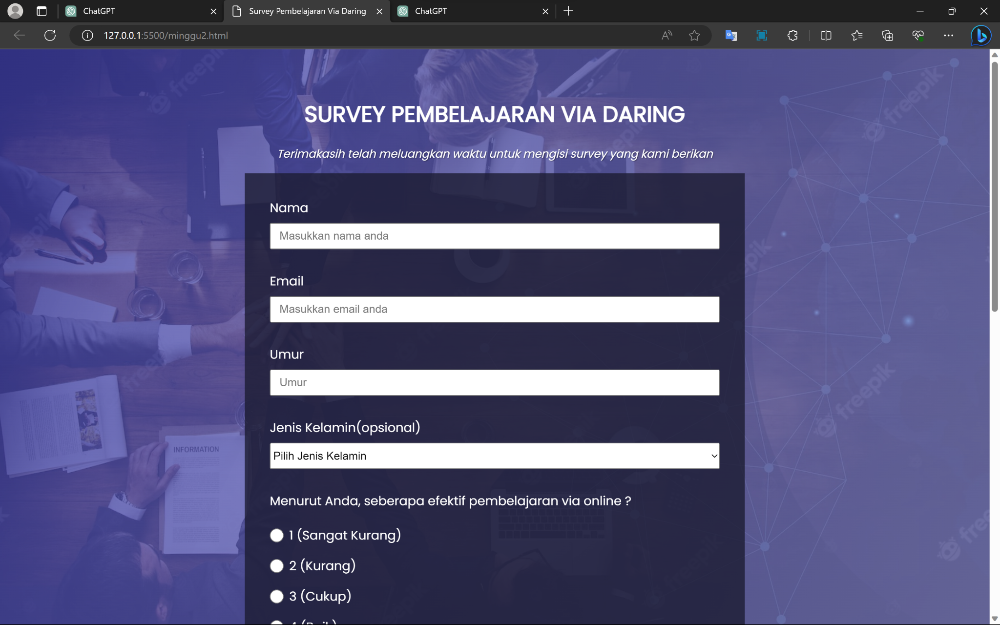
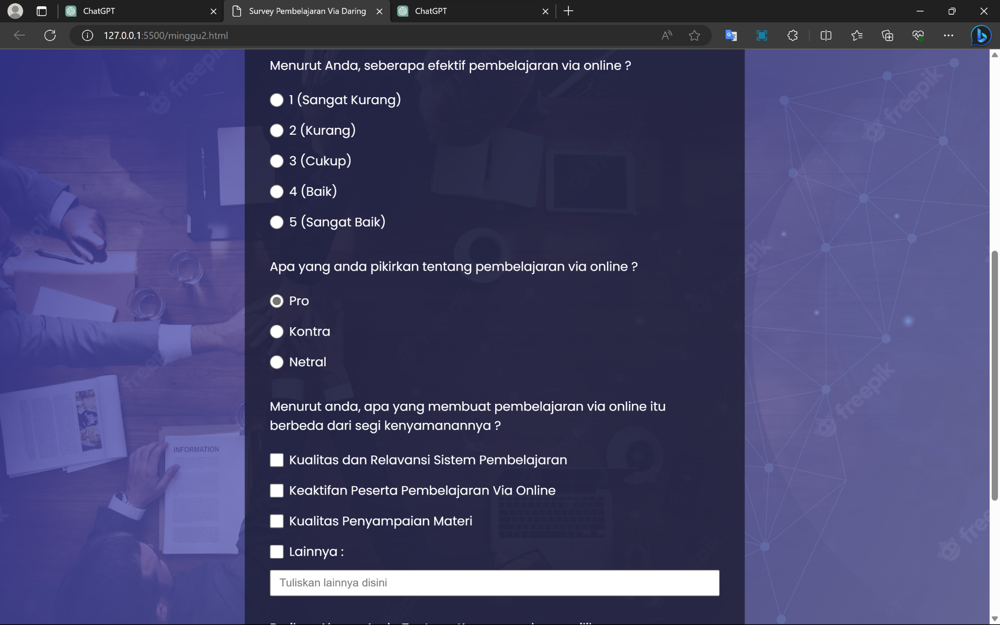
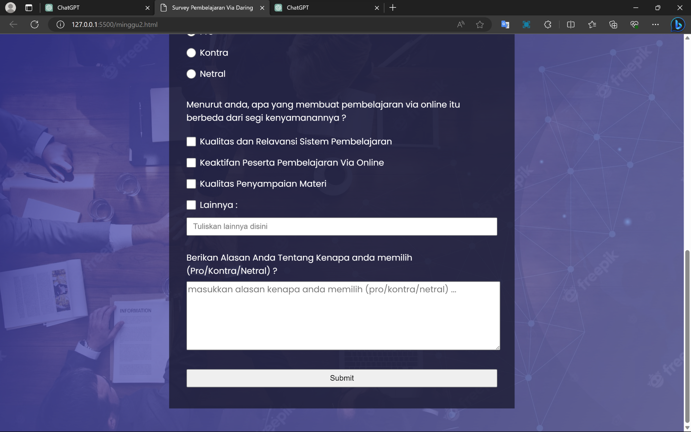

**Version 1.0 approved**

**Prepared by**

> **\<22091397040 -- Ahmad Zea C.S.D\>**
>
> **\<22091397051 -- Kevin Cahyo Pratama\>**
>
> **\<22091397069 -- M.Ilham Al Faridsi\>**

**\<11 September 2023\>**

**Table of Contents**

**1.** **Pendahuluan 1**

> 1.1 Tujuan Penulisan Dokumen 1
>
> 1.2 Audien yang Dituju dan Pembaca yang Disarankan 1
>
> 1.3 Batasan Produk 1
>
> 1.4 Definisi dan Istilah 1
>
> 1.5 Refrensi 1

**2.** **Deskripsi Keseluruhan 2**

> 2.1 Deskripsi Produk 2
>
> 2.2 Fungsi Produk 2
>
> 2.3 Penggolongan Karakterik Pengguna 2
>
> 2.4 Lingkungan Operasi 2
>
> 2.5 Batasan Desain dan Implementasi 2
>
> 2.6 Dokumentasi Pengguna 3

**3.** **Kebutuhan Antarmuka Eksternal 4**

> 3.1 User Interfaces 4
>
> 3.2 Hardware Interface 4
>
> 3.3 Software Interface 4
>
> 3.4 Communication Interface 4

**4.** **Functional Requirement 5**

> 4.1 Use Case Diagram 5
>
> 4.2 Nama Use Case 1 5
>
> 4.3 Nama Use Case 2 5
>
> 4.4 Class Diagram 6

**5.** **Non Functional Requirements 7**

**Revision History**

  ----------------------------------------------------------------------------
  **Name**        **Date**   **Reason For Changes**              **Version**
  --------------- ---------- ----------------------------------- -------------
                                                                 

                                                                 

                                                                 
  ----------------------------------------------------------------------------

1.  # Pendahuluan

    1.  ## Tujuan Penulisan Dokumen

```{=html}
<!-- -->
```
1.  Mengevaluasi kualitas pembelajaran dengan mengukur sejauh mana
    > pembelajaran dengan metode daring ini telah mencapai tujuannya dan
    > apakah metode tersebut sudah memenuhi standar kualitas pendidikan.

2.  Mengevaluasi kinerja tenaga pendidik dalam pembelajaran daring.

3.  Memahami apakah kurikulum dalam materi pembelajaran secara daring
    > efektif dan sesuai dengan perkembangan peserta didik.

4.  Mendapatkan tanggapan umpan balik dari peserta didik tentang
    > pengalaman dalam pembelajaran daring.

5.  Merumuskan rencana perbaikan berdasarkan temuan survei.

    1.  ## Audien yang Dituju dan Pembaca yang Disarankan

Audien yang dituju dalam survei ini meliputi peserta didik, pengajar,
wali murid, pengembang kurikulum dan peneliti/ahli Pendidikan, dan
pembaca yang disarankan dalam web survei ini mancakup pimpinan
institusi, pengajar, tim pengembang kurikulum dan ahli Pendidikan.

## Batasan Produk

Dalam survei ini menggunakan perangkat lunak berbasis web (Web
Application Software) dengan tujuan agar pengguna lebih mudah untuk
mengakses web survey ini, karena dengan menggunakan web pengguna dapat
mengakses dari berbagai perangkat dan lokasi asalkan terhubung dengan
internet, selain itu perangkat lunak berbasis web juga memiliki
fleksibilitas yang besar.

## Definisi dan Istilah

-   Survey : *Self-administered survey*

> Metode pengumpulan data primer dengan memberikan beberapa pertanyaan
> kepandan responden individu

-   Website : Halaman informasi yang disediakan melalui jalur internet
    > sehingga bisa diakses diseluruh dunia selama terkoneksi dengan
    > jaringan internet

-   Daring : *Dalam Jaringan*

> Segala sesuatu yang dilakukan secara online

-   SRS : *Software Requirements Specification*, atau

> Spesifikasi Kebutuhan Perangkat Lunak (SKPL)

-   IEEE : *Institute of Electrical and Electronics Engineering*

Standar internasional untuk pengembangan dan perancangan produk.

## Referensi

*\<Tulis daftar dokumen lain atau alamat web yang menjadi acuan SRS
ini.\>*

2.  # Deskripsi Keseluruhan

    1.  ## Deskripsi Produk 

Web survey pembelajaran daring ini merupakan web yang berisikan survey
terhadap pembelajaran daring yang mana ditujukan kepada para peserta
didik untuk menguji seberapa efektif pembelajaran daring terhadap
kurikulum pembalajaran.

## Fungsi Produk 

Web survey ini memiliki beberapa fungsi diantaranya :

1.  Mengukur kepuasan peserta didik

2.  Mengevaluasi pengalaman belajar

3.  Menilai teknologi dan aksesibilitas seperti masalah teknis yang
    > mereka hadapi selama pembelajaran.

4.  Mengumpulkan masukan dan saran untuk meningkatkan metode
    > pembelajaran

5.  Data survey juga dapat digunakan untuk perencanaan jangka panjang
    > dan pengambilan keputusan

    1.  ## Penggolongan Karakterik Pengguna

*\<Identifikasi berbagai golongan pengguna yang terkait dengan produk
yang dikembangkan\>*

**Tabel 1 Karakteristik Pengguna**

  ---------------------------------------------------------------------------
  **Kategori    **Tugas**          **Hak Akses ke         **Kemampuan yang
  Pengguna**                       aplikasi**             harus dimiliki**
  ------------- ------------------ ---------------------- -------------------
  Participant   Mengisi form       Insert Data            Entry Data Survey
                survey                                    

  Admin         Mengumpulkan Data  Insert, Update, Delete Manupulasi Data
                Survey             Data                   Survey

                                                          

                                                          
  ---------------------------------------------------------------------------

## Lingkungan Operasi 

Server web dapat dijalankan menggunakan sistem operasi dan search
engine:

1.  Windows

2.  Android 4.4 dan diatasnya

3.  Google Chrome

4.  Mozilla Firefox

5.  Yahoo, dsb

6.  Terdapat koneksi internet.

*\<Jelaskan lingkungan di mana perangkat lunak akan beroperasi, termasuk
platform, perangkat keras, sistem operasi dan versi, dan komponen
perangkat lunak lain atau aplikasi yang berdampingan\>*

## Batasan Desain dan Implementasi 

1.  Server web tidak dapat diakses selama device tidak terkoneksi dengan
    > internet.

2.  

*\<Jelaskan setiap item atau masalah yang akan membatasi pilihan yang
tersedia untuk para pengembang / developer. Ini mungkin termasuk:
kebijakan perusahaan atau peraturan; keterbatasan hardware (persyaratan
memori); teknologi tertentu, alat, dan database yang akan digunakan;
persyaratan bahasa; protokol komunikasi; pertimbangan keamanan; atau
standar pemrograman\>*

## Dokumentasi Pengguna

*\<Daftar komponen dokumentasi pengguna (seperti user manual, on-line
help, dan tutorial) yang akan disampaikan bersama dengan perangkat lunak
yang akan dikirim\>*

## Asumsi dan Ketergantungan

1.  Web ini harus tersambung oleh koneksi internet untuk mengaksesnya

2.  Web dapat diakses dimanapun dan kapanpun selama terdapat koneksi
    > internet

*\<Cantumkan asumsi faktor apa pun (berlawanan dengan fakta yang
diketahui) yang dapat memengaruhi persyaratan yang dinyatakan dalam SRS.
Ini dapat mencakup komponen pihak ketiga atau komersial yang Anda
rencanakan untuk digunakan, masalah seputar pengembangan atau lingkungan
pengoperasian, atau kendala. Proyek dapat terpengaruh jika asumsi ini
tidak benar, tidak dibagikan, atau diubah. Identifikasi juga
ketergantungan apa pun yang dimiliki proyek pada faktor eksternal,
seperti komponen perangkat lunak yang ingin Anda gunakan kembali dari
proyek lain, kecuali jika sudah didokumentasikan di tempat lain
(misalnya, dalam dokumen visi dan ruang lingkup atau rencana proyek).\>*

3.  # Kebutuhan Antarmuka Eksternal

    1.  ## User Interfaces 

*Antarmuka pengguna yang digunakan pada perangkat lunak Survey
Pembelajaran Via Daring ini berbasis teks dan web yang diinputkan
melalui keyboard dan mouse. Antarmuka antar pengguna terdiri dari
beberapa bagian berikut yang semuanya ditampilkan dalam bahasa
Indonesia.*

a.  Tampilan dari Page Pertama (index.html)

> {width="6.7in"
> height="4.194444444444445in"}
>
> {width="6.697916666666667in"
> height="3.8958333333333335in"}
>
> {width="6.697916666666667in"
> height="1.9282086614173228in"}

b.  Tampilan dari Page Kedua (surveyweb2.html)

> {width="6.7in"
> height="4.194444444444445in"}{width="6.697916666666667in"
> height="4.197916666666667in"}

c.  Tampilan dari Page Ketiga
    > (after-submit.html){width="6.7in"
    > height="4.194444444444445in"}

    1.  ## Hardware Interface

*\<Describe the logical and physical characteristics of each interface
between the software product and the hardware components of the system.
This may include the supported device types, the nature of the data and
control interactions between the software and the hardware, and
communication protocols to be used.\>*

## Software Interface

*\<Describe the connections between this product and other specific
software components (name and version), including databases, operating
systems, tools, libraries, and integrated commercial components.
Identify the data items or messages coming into the system and going out
and describe the purpose of each. Describe the services needed and the
nature of communications. Refer to documents that describe detailed
application programming interface protocols. Identify data that will be
shared across software components. If the data sharing mechanism must be
implemented in a specific way (for example, use of a global data area in
a multitasking operating system), specify this as an implementation
constraint.\>*

## Communication Interface

\<Describe the requirements associated with any communications functions
required by this product, including e-mail, web browser, network server
communications protocols, electronic forms, and so on. Define any
pertinent message formatting. Identify any communication standards that
will be used, such as FTP or HTTP. Specify any communication security or
encryption issues, data transfer rates, and synchronization
mechanisms.\>

# Functional Requirement

*\<Area ini menggambarkan pengorganisasian persyaratan fungsional untuk
produk dengan fitur sistem, layanan utama yang disediakan oleh produk\>*

*\<Tulis Kebutuhan Fungsional / Functional Requirement disini\>*

*Diawali dengan membuat daftar kebutuhan fungsional P/L, lengkap dengan
ID dan penjelasan jika perlu. Bisa dibuat dalam bentuk tabel.*

  -----------------------------------------------------------------------
  **ID**    **Kebutuhan Fungsional**           **Penjelasan**
  --------- ---------------------------------- --------------------------
                                               

                                               

                                               

                                               

                                               

                                               

                                               

                                               

                                               

                                               

                                               

                                               
  -----------------------------------------------------------------------

## Diagram Use Case

{width="6.7in"
height="4.819444444444445in"}

## Flowchart {width="5.020833333333333in" height="9.0in"}

# Non Functional Requirements

\<*Uraikan dengan ringkas kebutuhan non fungsional dalam tabel sebagai
berikut. Isilah Kolom Kebutuhan dengan kalimat yang jelas dan kelak
dapat ditest untuk dipenuhi. ID adalah nomor kebutuhan yang harus
ditelusuri pada saat test. Tuliskan N/A bila Not Applicable\>*

  -------------------------------------------------------------------------
  **ID**        **Parameter**   **Kebutuhan**
  ------------- --------------- -------------------------------------------
                Availability    

                Reliability     

                Ergonomy        

                Portability     

                Memory          

                Response time   

                Safety          N/A

                Security        

                                

                Others 1:       Misalnya : semua tanya jawab harus dalam
                Bahasa          bahasa Indonesia
                komunikasi      

                                Setiap layar harus mengandung logo PT Pos
                                Indonesia

                                
  -------------------------------------------------------------------------

*Catatan :*

*Availability : ketersediaan aplikasi, misalnya harus terus menerus
beroperasi 7 hari perminggu, 24 jam per haritanpa gagal*

*Reliability : keandalan, misalnya tidak pernah boleh gagal(atau
kegagalan yang ditolerir adalah ...%) sehingga harus dipikirkan fault
tolerant architecture. Biasanya hanya perlu untuk Critical Application
yang jika gagal akan berakibat fatal.*

*Ergonomy : kenyamanan pakai bagi pengguna*

*Portability : kemudahan untuk dibawa dan dioperasikan ke mesin/sistem
operasi/platform yang lain*

*Memory : jika perhitungan kapasitas memori internal kritis (misalnya
untuk SW yang harus dijadikan CHIPS dan ukurannya harus kecil*

*Response time : Batasan waktu yang harus dipenuhi. Sangat penting untuk
aplikasi Real Time. Contoh: "Aaplikasi harus mampu menampilkan hasil
dalam 4 detik", atau "ATM harus menarik kembali kartu yang tidak diambil
dalam waktu 3 menit"*

*Safety: yang menyangkut keselamatan manusia, misalnya untuk SW yang
dipakai pada sistem kontrol di pabrik*

*Security : aspek keamanan yang harus dipenuhi*
